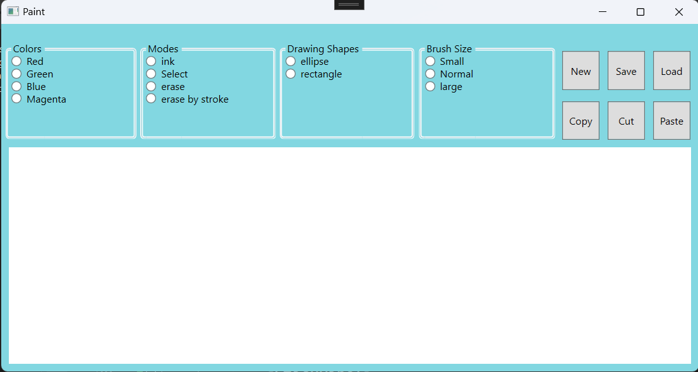

# Paint-App-CSharp-WPF
A simple WPF application using InkCanvas for drawing and various functionalities.

## Description

This WPF application provides a basic drawing canvas using InkCanvas with features such as changing colors, drawing modes, shapes, and brush sizes. Users can also perform actions like copy, cut, paste, save, load, and clear the canvas.

## Features

- Drawing in ink mode
- Selecting and erasing strokes
- Changing colors
- Choosing different drawing shapes (ellipse, rectangle)
- Adjusting brush size
- Copy, cut, paste functionalities
- Save and load the canvas state

## Getting Started

1. Clone the repository:

   ```bash
   git clone https://github.com/FatmaSorour8/Paint-with-CSharp-WPF.git
   
2. Open the project in Visual Studio.

3. Build and run the application.

## Screenshots



## Usage

- Use the radio buttons to select color, drawing mode, shape, and brush size.
- Buttons for New, Save, Load, Copy, Cut, and Paste provide additional functionality.


